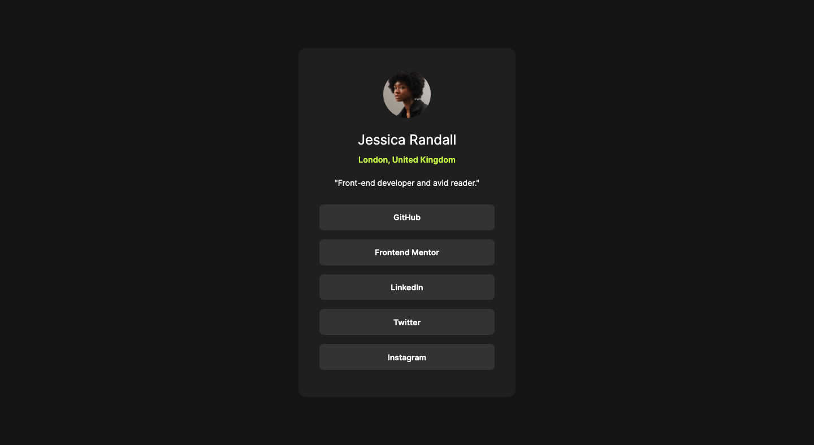
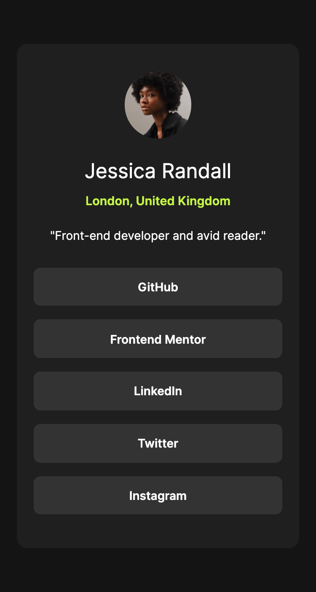

# Frontend Mentor - Social links profile solution

This is a solution to the [Social links profile challenge on Frontend Mentor](https://www.frontendmentor.io/challenges/social-links-profile-UG32l9m6dQ). Frontend Mentor challenges help you improve your coding skills by building realistic projects. 

## Table of contents

- [Overview](#overview)
  - [The challenge](#the-challenge)
  - [Screenshot](#screenshot)
  - [Links](#links)
- [My process](#my-process)
  - [Built with](#built-with)
- [Author](#author)

## Overview

### The challenge

Users should be able to:

Your challenge is to build out this social links profile and get it looking as close to the design as possible.

- See hover and focus states for all interactive elements on the page

### Screenshot

### Links

- Solution URL: [Github](https://github.com/thisispeterj/frontEndMentor-social-links-profile)
- Live Site URL: [Github Pages Demo](https://thisispeterj.github.io/frontEndMentor-social-links-profile/)

## My process

I began by reviewing both the desktop and mobile designs provided to begin thinking about how I would structure the HTML. I wanted it to be as semantic as possible and efficient as possible. I then reviewed the style guide and began to add the CSS styles, including the provided fonts, colors, and other style attributes. 

### Built with

- Semantic HTML5 markup
- CSS custom properties
- Flexbox
- Mobile-first workflow

## Author

- Website - [thisispeterj.com](https://www.thisispeterj.com)
- Frontend Mentor - [@thisispeterj](https://www.frontendmentor.io/profile/thisispeterj)
- Linkedin - [@thisispeterj](https://www.linkedin.com/in/thisispeterj/)

